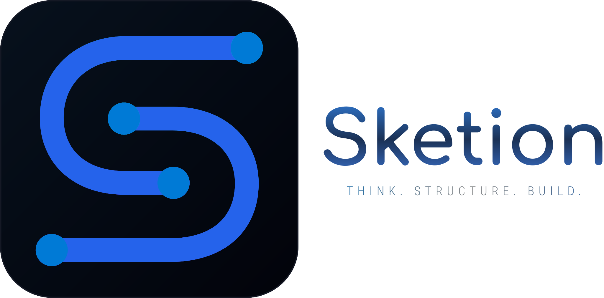

<div align="center">



# Sketion

**Visual Knowledge Workspace — Think. Structure. Build.**

[](https://github.com/luisrodriguez-rgb)
[](https://sketion.com)
[](https://reactjs.org/)
[](https://www.typescriptlang.org/)
[](https://supabase.com)

[🚀 Explorar Sketion](https://sketion.com) • [✅ Funciones Hoy](#-lo-que-existe-hoy) • [🔬 Ecosistema Técnico](#-ecosistema-acad%C3%A9mico--t%C3%A9cnico-de-alto-impacto) • [🛣️ Roadmap 2026](#%EF%B8%8F-roadmap-2026)

</div>

---

## 💡 Acerca de Sketion

**Sketion** es un **Visual Knowledge Workspace** para aprender, pensar, estructurar información, diseñar sistemas, documentar conocimiento y construir con IA. Permite integrar documentos **PDF**, fórmulas **LaTeX**, diagramas **Mermaid**, tablas nativas, notas en **Markdown**, salas de colaboración en tiempo real y herramientas de estudio en un único espacio visual.

---

## 🚀 Visión de Sketion

> **Where knowledge becomes visual.**

Sketion está optimizado para el **estudiante técnico, ingeniero, desarrollador e investigador**. Nuestra visión es construir un **Visual Knowledge Workspace** donde se integre el flujo completo de pensamiento, estructura y construcción:

```text
Profesor / Equipo entrega PDF
              ↓
  Importación al Canvas (PDF Engine)
              ↓
 Gráfica interactiva GeoGebra + Ecuaciones LaTeX
              ↓
  Vista previa de Notebook Google Colab / Python
              ↓
     Notas en Markdown & Flashcards
              ↓
   Repaso activo antes del examen o entrega
```

---

## 🔬 Ecosistema Académico & Técnico de Alto Impacto

**Sketion** integra directamente herramientas que generan y representan conocimiento visual científico y de ingeniería:

1. **🐍 Google Colab & Jupyter Cards**: Tarjetas enriquecidas con vista previa de celdas de código Python y gráficas.
2. **📐 GeoGebra Web Embed**: Embebido interactivo de construcciones geométricas, cálculo y álgebra lineal (costo 0.0).
3. **𝚺 LaTeX Avanzado (KaTeX Engine)**: Compilación local instantánea de matrices, integrales, derivadas e Investigación Operativa.
4. **📊 Data-to-Chart Pipeline**: Conversión de datos copiados de Excel/Sheets o archivos `.csv` en gráficos vectoriales.
5. **🧜‍♂️ Mermaid.js Code-to-Diagram**: Generación de diagramas de secuencia, flujos y arquitecturas a partir de código.

---

## ✅ Lo que Existe Hoy (100% Funcional)

Las siguientes capacidades se encuentran completamente implementadas y listas para usar en producción:

| Módulo | Estado | Descripción |
| :--- | :---: | :--- |
| ⚡ **PDF Fast Engine** | `✅ Disponible` | Renderizado nativo de PDFs multicapa sobre el canvas con compresión ultraliviana. |
| 📊 **Google Sheets Importer** | `✅ Disponible` | Conversión de celdas copiadas de Excel/Sheets (`Cmd+C`) a tablas editables (`Cmd+V`). |
| 🎓 **Modo Estudio (Flashcards)** | `✅ Disponible` | Tarjetas de memorización activa con seguimiento de progreso e interfaz interactiva. |
| 🔒 **Control de Roles por URL** | `✅ Disponible` | Enlaces de solo lectura (`?role=viewer`) y comentarios (`?role=commenter`). |
| 📂 **Dashboard & Workspaces** | `✅ Disponible` | Organización por carpetas, filtros de búsqueda y papelera de reciclaje. |
| 🔄 **Persistencia Híbrida** | `✅ Disponible` | Arquitectura Local-First (IndexedDB) con sincronización automática en la nube (Supabase). |
| 📝 **Notas Markdown & Comentarios** | `✅ Disponible` | Panel lateral de especificaciones en Markdown y hilos de comentarios anclados. |
| 🎬 **Modo Presentación Cine** | `✅ Disponible` | Marcos estilo diapositivas con zoom reactivo y exportación a PowerPoint (.pptx). |
| 💳 **Persistencia de Planes** | `✅ Disponible` | Gestión de suscripciones (*Gratuito / Pro / Empresarial*) persistida en cuenta y storage. |

---

## 🎯 Casos de Uso Principales

| Caso de Uso | Nivel de Cobertura | Beneficio Clave |
| :--- | :---: | :--- |
| 🎓 **Universidad & Ingeniería** | ⭐⭐⭐⭐⭐ | PDFs en canvas + GeoGebra + LaTeX + Modo Estudio (Flashcards) |
| 🛠️ **Programación & Data Science** | ⭐⭐⭐⭐⭐ | Google Colab Cards, Mermaid.js y diagramas de arquitectura |
| 🏗️ **Arquitectura de Sistemas** | ⭐⭐⭐⭐⭐ | Plantillas de diseño hexagonal, microservicios y RAG |
| 💼 **Product Management & Análisis** | ⭐⭐⭐⭐ | Importación de Google Sheets y seguimiento de sprints |
| 🎬 **Workshops & Presentaciones** | ⭐⭐⭐⭐ | Modo presentación diapositivas + Exportación a PPTX |
| 💡 **Brainstorming Rápido** | ⭐⭐⭐⭐⭐ | Pizarra infinita colaborativa Local-First instantánea |

---

## 📊 Tabla Comparativa: Sketion vs. Excalidraw Original

| Característica | Excalidraw Estándar | Sketion Workspace |
| :--- | :---: | :---: |
| **Documentos PDF en Canvas** | ❌ No soportado | ⚡ **Renderizado nativo ultra-liviano** |
| **Tablas de Google Sheets & CSV** | ❌ No soportado | 📊 **Conversión instantánea a tablas editables** |
| **Modo Estudio & Flashcards** | ❌ No soportado | 🎓 **Tarjetas de memorización activa con progreso** |
| **Control de Roles por URL** | ❌ No disponible | 🔒 **Modo Lector (`?role=viewer`) y Comentador (`?role=commenter`)** |
| **Dashboard y Workspaces** | ❌ Pizarra única volátil | 📂 **Gestión por carpetas, papelera y filtros** |
| **Persistencia de Datos** | ⚠️ Solo LocalStorage básico | 🔄 **Local-First (IndexedDB) + Nube (Supabase Cloud Sync)** |
| **Notas Enriquecidas** | ❌ Texto plano | 📝 **Panel lateral de especificaciones en Markdown** |
| **Comentarios Interactivos** | ❌ No disponible | 💬 **Hilos de comentarios anclados a figuras** |
| **Modo Presentación Cine** | ⚠️ Básico | 🎬 **Marcos estilo diapositiva + Exportación a PPTX** |
| **Navegación & Chat Colaborativo** | ❌ No disponible | 🗺️ **Minimapa flotante + Chat lateral en tiempo real** |
| **Gestión de Cuota / Planes** | ❌ No disponible | 💳 **Persistencia de planes Pro/Empresarial** |

---

## 🛣️ Roadmap 2026

Nivel de madurez actual del ecosistema:

```text
✅ Workspace / Dashboard           90%
✅ PDFs                            95%
✅ Google Sheets                   90%
✅ Flashcards                      85%
✅ Comentarios                     80%
✅ Roles                           80%

🚧 Librerías Premium              60%
🚧 Plantillas Profesionales        35%
🚧 Motores Visuales (DSL)          30%
🚧 Ecosistema Académico-Técnico    20%
🚧 Skills IA                       10%
```

---

### 🔹 Fase 1 — Núcleo del Workspace (✅ 100% Completado)

- [x] Persistencia Local-First con IndexedDB y Supabase Cloud Sync
- [x] Motor de importación de PDFs en canvas
- [x] Conversión de Google Sheets / CSV a tablas vectoriales
- [x] Modo Estudio con tarjetas de memoria interactiva (Flashcards)
- [x] Enlaces compartidos con restricción de roles (`?role=viewer` / `?role=commenter`)

---

### 🔹 Fase 2 — Ecosistema Académico & Técnico (🚧 En Desarrollo)

- [x] Motor LaTeX KaTeX básico
- [ ] Renderizado nativo de ecuaciones LaTeX compuestas
- [ ] Componente `GeoGebraEmbedNode` para trazado dinámico de funciones
- [ ] Tarjetas enriquecidas de Google Colab & Jupyter Notebooks
- [ ] Conversor de código Mermaid.js a elementos vectoriales

---

### 🔹 Fase 3 — Motores Visuales & Schemas (🚧 En Progreso)

- [x] Motor `matriz` (SWOT, Lean Canvas, RICE)
- [x] Motor `board` (Kanban, Scrum, Pipelines)
- [x] Motor `flujo` (Process, User Journey, SOP)
- [x] Motor `timeline` (Gantt, Roadmaps, Calendarios)
- [x] Motor `red` (System Design, Microservicios, RAG)
- [x] Motor `dashboard` (KPIs, Operaciones, Finanzas)
- [x] Motor `cerebro` (Mind Maps, Radial Hubs)
- [x] Motor `arbol` (Org Chart, Trees)
- [x] Motor `storyboard` (Slides, Pitch Decks)
- [ ] Catálogo extendido con más de 230 plantillas en Schemas JSON

---

### 🔹 Fase 4 — Generación Asistida por IA & Skills (📝 Investigación)

- [x] Clasificador de intenciones por lenguaje natural (`aiSkillEngine.ts`)
- [ ] Generación automática de diagramas complejos a partir de prompts estructurados
- [ ] Asistente de resumen e inteligencia espacial para notas y PDFs

---

## 🛠️ Guía de Instalación Local

```bash
# 1. Clonar el repositorio
git clone https://github.com/luisrodriguez-rgb/SKETION.git

# 2. Entrar al directorio
cd SKETION/My-Excalidraw/excalidraw

# 3. Dar permisos de ejecutable e instalar dependencias
yarn install

# 4. Iniciar el servidor de desarrollo local
npm run start
```

---

## 👨‍💻 Creador & Mantenimiento

Desarrollado y mantenido por **Luis Rodriguez** ([@luisrodriguez-rgb](https://github.com/luisrodriguez-rgb)).

<div align="center">
  <a href="https://github.com/luisrodriguez-rgb">
    
    <br/>
    <strong>Luis Rodriguez (luisrodriguez-rgb)</strong>
  </a>
</div>
