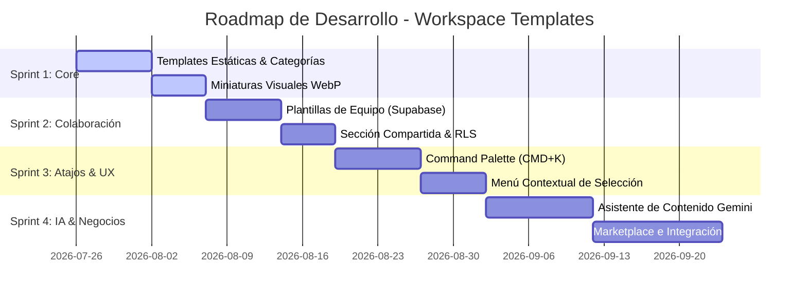

# Roadmap Maestro & Plan de Implementación: Workspace Templates Platform

Este plan valida, expande y detalla la estrategia de ingeniería para implementar las 10 fases del "Roadmap Maestro", transformando la aplicación de un editor gráfico simple a una plataforma de productividad visual de nivel empresarial.

---

## 1. Validación Técnica por Fases

### FASE 1 — Biblioteca de Plantillas Premium
* **Estado:** Completado (Lanzamiento inicial).
* **Validación:** El uso de plantillas basadas en código estático con la firma `getElements(content)` en [templates.ts](file:///Users/leonfeliperodriguez/Desktop/Trabajos/My-Excalidraw/My-Excalidraw/excalidraw/excalidraw-app/data/templates.ts) provee velocidad de carga instantánea por CDN sin latencia de consulta.
* **Siguientes pasos:** Expandir el catálogo a las 15 plantillas detalladas en el roadmap (agregando System Design, Mind Map, RAG Architecture, etc.).

### FASE 2 — Miniaturas Profesionales
* **Estado:** En Progreso (Usa preview base64 para plantillas de equipo).
* **Validación:**
  * **Opción 1 (Miniaturas estáticas PNG/SVG):** Óptima para plantillas de sistema (cargadas directamente desde `/public/templates/thumbnails/`).
  * **Opción 2 (Render automático):** Necesaria para plantillas de equipo. Utilizaremos el exportador de Excalidraw `exportToSvg` o `exportToCanvas` al momento del guardado para generar y comprimir el preview en base64 de baja resolución.

### FASE 3 — Categorías y Explorador (Taxonomía)
* **Estado:** Completado (Lanzamiento inicial).
* **Validación:** Agrupación y filtrado implementado bajo las categorías: `Business & Strategy`, `Product & Engineering` y `Design & UI` junto con la pestaña de `Plantillas del Equipo`.

### FASE 4 y 5 — Guardar como Plantilla & Biblioteca Compartida
* **Estado:** Completado (Lanzamiento inicial).
* **Validación:** La lógica de persistencia en la tabla `templates` de Supabase desacopla las plantillas de los tableros del usuario. Las políticas RLS garantizan que cualquier miembro autenticado del workspace pueda leer las plantillas compartidas del equipo.

### FASE 6 — Command Palette (CMD + K)
* **Prioridad:** Muy Alta | **Impacto:** Muy Alto | **Complejidad:** Media
* **Especificación Técnica:**
  * Crear un componente modal global `<CommandPalette />` montado en el layout principal.
  * Captura de atajo de teclado: Event listener de `keydown` interceptando `(metaKey || ctrlKey) && key === 'k'`.
  * Indexación en memoria de acciones disponibles:
    * `"Crear [Nombre de Plantilla]"` -> Llama a `handleCreateBoard(templateId)`.
    * `"Insertar [Nombre de Elemento]"` -> Inserta componentes directo al lienzo actual.
    * `"Presentar"` -> Activa el modo presentación.
    * `"Cambiar a modo oscuro"` -> Modifica el tema global.

### FASE 7 — Menú Contextual Inteligente
* **Prioridad:** Alta | **Impacto:** Alto | **Complejidad:** Media
* **Especificación Técnica:**
  * Interceptar el evento de selección de elementos de Excalidraw.
  * Añadir acciones personalizadas sobre la selección actual (ej: "Convertir selección en plantilla", "Exportar selección a biblioteca", "Presentar selección").

### FASE 8 — IA para Rellenar Plantillas (Asistencia de Contenido)
* **Estado:** Completado.
* **Validación:** El motor de IA clasifica la intención del usuario, selecciona el layout base óptimo y reescribe los cuadros de texto sin deformar el diagrama original. Esto elimina por completo el riesgo de coordenadas inválidas u objetos empalmados.

### FASE 9 — Marketplace de Plantillas
* **Prioridad:** Media | **Impacto:** Muy Alto | **Complejidad:** Alta
* **Especificación Técnica:**
  * Crear una base de datos `template_marketplace` con calificaciones, descargas, versión y flag de `is_verified` (plantillas premium aprobadas).
  * Panel de publicación: Permite a creadores externos subir y describir plantillas a la tienda común del ecosistema.

### FASE 10 — Componentes Inteligentes
* **Prioridad:** Estratégica | **Impacto:** Enorme | **Complejidad:** Muy Alta
* **Especificación Técnica:**
  * En lugar de tratar a los tableros como dibujos planos, enlazaremos metadatos (customData) a los elementos Excalidraw.
  * **Kanban Card:** Los campos de texto contienen atributos estructurados (`status: "todo" | "doing" | "done"`, `assignee`, `storyPoints`).
  * **Database Table:** Mapeo de columnas y tipos de datos. Al conectar flechas entre tablas, el sistema dibuja automáticamente relaciones de claves foráneas e índices.

---

## 2. Cronograma de Sprints Sugerido

---

## 3. Preguntas Abiertas & Decisiones de Diseño

> [!IMPORTANT]
> 1. **Para la Command Palette (CMD + K): ¿Prefieres que sea accesible únicamente dentro del editor de tableros para acelerar el dibujo, o también en el Dashboard de inicio para buscar tableros y carpetas rápidamente?**
> 2. **Para las Miniaturas Profesionales: ¿Te parece bien que pre-generemos imágenes PNG estáticas estilizadas para las plantillas predefinidas del sistema (para que luzcan perfectas y corporativas) y usemos render automático SVG de baja calidad solo para las plantillas que guarden los usuarios en sus equipos?**
